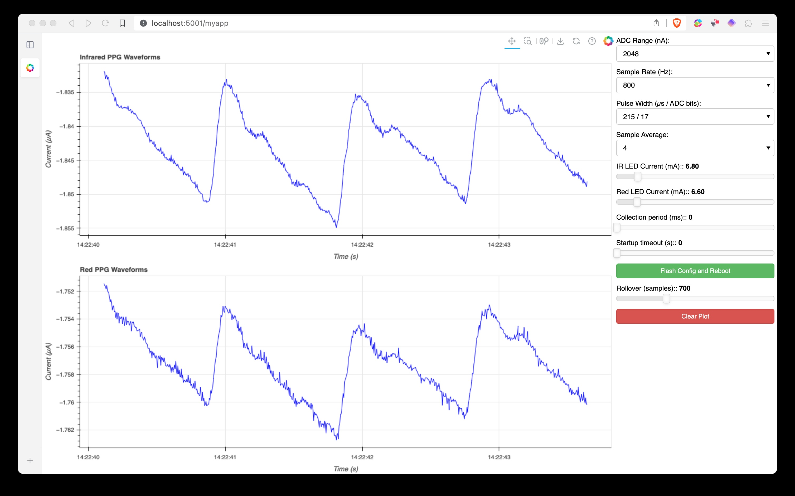

# PPGView

PPGView is a web utility to display realtime photoplethysmograph (PPG) readings from the MAX30101 sensor.
It is also used to collect data and configure the device.
The web interface connects to the sensor over a Bluetooth Low Energy (BLE) interface.



## Features

These features assume the connected device supports all of these features (true for the [`tegsense-firmware`](https://github.com/TEGSense/tegsense-firmware)).

- Red and infrared (IR) PPG waveform capture.
- Device configuration options for ADC scaling, sample rate, pulse width, device averaging, and LED currents.
- Single-shot or continuous measurement options.
- Startup measurement delay.
- Sensor settings stored to flash.
- Real-time plotting with zooming, scrolling, and figure saving.
- Input and output data capture.
- Wireless BLE interface which handles device disconnects gracefully.

## Limitations

### Device compatibility

The software was developed to interface with an application-specific research device, although it's useful for any PPG application.
This is configured to connect to a BLE device named "TEGSense" which uses the Nordic UART Service (NUS) to telemeter PPG waveforms and sensor configuration details.
This can actually be any BLE device (Arduino or otherwise) that's configured to telemeter the data in the expected format (specified below).
If you have a Noridc development board handy, you can also use the firmware available in the [`tegsense-firmware`](https://github.com/TEGSense/tegsense-firmware) repository.
It will look for any device named "TEGSense" and try to connect to the first device that matches that criteria.

Future improvements:

- Arduino firmware implementation.
- Serial interface.
- Support for device selection.

### Sensor configuration

Currently, the device is configured to handle just the red and infrared (IR) measurements.
The green LED or proximity modes cannot be enabled through this interface.
You can also not initiate other sensor actions, like soft (or hard) resets or FIFO clears.
The firmware implementation does offer the capability to store sensor settings to flash and reboot.

Future improvements:

- Support green LED and proximity use cases.
- Add support for device actions (reset, FIFO configuration).
- Add S<sub>p</sub>O<sub>2</sub>, HR, and HRV computations.
- Add filtering support.

## Installation

If you run

```bash
pip install .
```

in the root directory, it will add a link to the `ppgview` application in your environment.
Just run `ppgview` to start the web interface.
You need Bluetooth enabled and it will immediately (and continuously) (and indiscriminantly) scan for devices named `TEGSense` then wait for them to send data.
You just need a device with that name that sends data.

## Data format

You don't have to use the original device or firmware, you can modify the code to use anything reasonably compatible, or configure your own device to package the data accordingly.
The incoming packet format is defined in [`packet.py`](src/ppgview/packet.py#61) and currently looks like this (in little endian format):

```yaml
time: uint32
pid: uint16
cfg: uint8
fifo_cfg: uint8
cp_cfg: uint8
red_pa: uint8
ir_pa: uint8
<pad>: byte
N: uint16
<pad>: byte * 2
red: uint32 * N
ir: uint32 * N
```

You fill find the [MAX30101 datasheet](https://www.analog.com/en/products/max30101.html) helpful at this point.

- **`time`** is the MCU timestamp (ms since startup) roughly corresponding to the first measurement.
- **`pid`** is the packet ID.
- **`cfg`** is the MAX30101 SpO2 configuration register (`0x0A`).
- **`fifo_cfg`** is the MAX30101 FIFO configuration register (`0x08`).
- **`cp_cfg`** is the collection mode configuration (see below).
- **`red_pa`** is the MAX30101 red LED pulse amplitude configuration register (`0x0C`).
- **`ir_pa`** is the MAX30101 IR LED pulse amplitude configuration register (`0x0D`).
- **`N`** is the number of data samples (currently 50, and the device only sends full packets).
- **`red`** is an array of `N` red photodetector ADC samples.
- **`ir`** is an array of `N` IR photodetector ADC samples.

The collection mode configuration is split into two nibbles:

```yaml
startup_timeout: uint4
collection_period: uint4
```

- **`startup_timeout`** is a delay (0-150 seconds) between startup events (MCU boot and device configuration) and data collection in 10 second increments.
- **`collection_period`** is the data collection time (500-7500 ms) after the startup event.
Setting to `0` configures continuous measurement.

## License

[MIT license](LICENSE)

## Author

This software was developed by Anthony Wertz.
